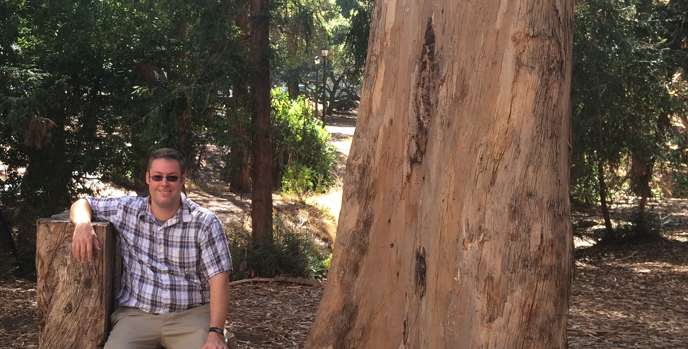

<a class="twitter-timeline pull-right" height=400px href="https://twitter.com/holtbg" data-widget-id="545291687996571648">Tweets by @holtbg</a>

## News
<ul class="news list-unstyled">

    
        <li class="shortnews">
            {{ post.date | date_to_long_string }}
            {{ post.content }}
        </li>
    
        <li class="bloglink">
            {{ post.date | date_to_long_string }}
            <a href="{{site.base}}{{ post.url }}">&raquo; {{ post.title }}</a>
        </li>
    

</ul>



<a href="{{ site.base }}/posts/">&hellip;</a>



## About Me
I recently completed my Ph.D. in Computer Science at Rensselaer Polytechnic Institute under my advisor [Christopher Carothers](http://www.cs.rpi.edu/~chrisc).
My research interests include high performance computing (HPC), parallel discrete-event simulations (PDES), optimistic simulation using Jefferson's Time Warp protocol, and how to reduce development time and complexity by leveraging the compiler.
The majority of this research has been conducted using [Rensslaer's Optimistic Simulation System (ROSS)](https://github.com/carothersc/ROSS) which was developed by Dr. Carothers and his graduate students over the years.

## Research Interests
I'm interested in helping people solve tough problems using the most powerful computer they have available.
Right now, the *tough problems* people seem to be facing involve analyzing and understanding large, irregular data sets (including such "Big Data" problems as social network analytics). These problems are particularly challenging because their execution is highly data-dependent and unpredictable, wreaking havoc on systems which are optimized for regular access patterns.

For many people — in particular, most data scientists — the *most powerful computer* they have access to is actually pretty beefy: a compute cluster, even if it's just an on-demand cluster from the cloud. These highly-parallel distributed-memory machines are notoriously difficult to do useful things with.

Solving these problems requires being willing to change any part of the traditional "stack": hardware, compiler, runtime, programming language, or tools. I enjoy hacking LLVM to automatically extract communication, develop fancy C++11 interfaces to runtimes, and exploring how to leverage high-level program information to optimize low-level runtime calls.

## Projects

Read more about various work in progress and past on the [Projects](projects/index.html) page. A few highlights:

- [Claret](projects/index.html#Claret): Bringing ADTs and approximate computing to NoSQL databases.
- [Grappa](projects/index.html#Grappa): Picking up the slack in commodity clusters for irregular applications.
- [Igor](projects/index.html#Igor): A system to make it easier to run parameter sweeps and collect data from experiments.

## Personal
Despite appearances, in addition to locking myself up in a room coding all day, I do other things as well. I enjoy hiking, soccer, frisbee, and sci-fi. I particularly like mountains, in which Washington is not disappointing me.
